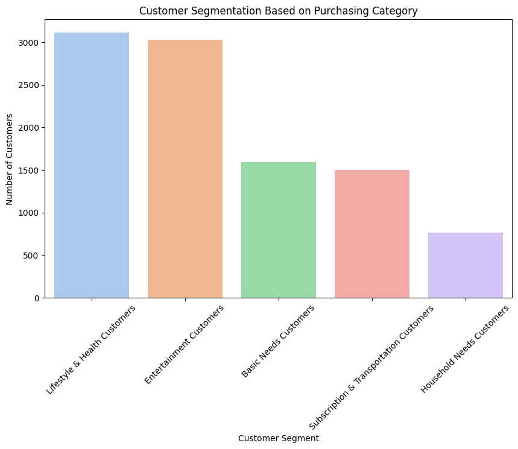

# Customer Spending Behavior Analysis

## Project Description
How does customer spending behavior differ in each category, and which categories are most dominant in terms of spending?

## Objectives
1. Analyze the revenue trends and sales performance from 2023 to 2024.
2. Identify key purchasing patterns across different product categories.
3. Evaluate the relationship between Price Per Unit and Sales Quantity.
4. Explore consumer preferences in different sales channels (In-Store, Online, Mobile App) and their impact on payment methods.
5. Provide strategic recommendations for optimizing sales and enhancing customer experience.

## Dataset
- **File Name**: `spending_patterns_detailed.csv`
- **Source**: [Kaggle Spending Patterns/Habit Dataset](https://www.kaggle.com/datasets/ahmedmohamed2003/spending-habits)
- **Dataset Size**: 10000 rows, 9 columns
- **Time Range Data Captured**: 2023 , 2024 and 2025 (will only be January).

## Tools and Technology
- Python: Pandas, Matplotlib, Seaborn, Numpy and Scipy
- Jupyter Notebook
- IBM Cognos Analytics: Dashboard

## Methodology
1. **Data Collecting**
   - Determine Data Source
   - Ensure Relevance and Purpose of Data
   - Import the data
2. **Data Preprocessing**
   - Search for Missing Value
   - Search for Duplicate Value
   - Search and handle Outliers
3. **Explolatory Data Analysis (EDA)**
   - Purchase Frequency
   - Frequently purchased products
   - Segmentation Costumers
   - Amount spent
   - Look for patterns related to Payment Method and Location
   - Proportion of Payment Method and Location
   - Trend Analysis
   - Comparison between cash and non-cash; In-store and Off-store
   - Comparison between Payment Methods and Locations
4. **Statistical Relationship Testing**
   - Price Per Unit and Quantity
   - Payment Method and Location

## Results and Conclusions
- Revenue from 2023 to 2024 remained stable, with no significant increase or decrease. In 2023, revenue was "$12.7M" with total sales of **"10.9k"** items, while in 2024, revenue was **"$12.5M"** with total sales of **"11.1k"** items.
- **"Lifestyle & Health Consumer"** dominant, This shows consumption trends that focus on healthy lifestyles, personal hygiene and shopping for personal necessities. It would be better to offer discounts or membership packages to attract customers who frequently shop in this segment
- **"Entertainment Consumer"** second most, this could indicate that customers prefer experiences over physical products, such as recreation and entertainment. You can target customers with promotions for concert events, holiday packages or group entertainment. Or Using experience-based marketing strategies (experience marketing).
- **"Other segments have smaller numbers"**, If you want to increase this segment. For example, to increase Basic Needs Customers, you can offer special discounts or bundling food products and daily necessities.
- The **"Subscriptions"** and **"Transportation"** categories had lower purchase volumes compared to others, but they still reflected consistent consumer demand.
- **"Price Per Unit"** did not have a significant impact on Sales Quantity.
- **"In-Store"**: Focus on promotions and enhancing the convenience of Digital Wallet payments.
- **"Online"**: Strengthen payment options, particularly for Cash transactions.
- **"Mobile App"**: Maintain a flexible approach due to the balanced distribution of payment method preferences.

## Visualization Screenshots

## Related Files
- `spending_patterns_detailed.csv`: Dataset used.
- `Customer Spending Behavior Analysis.ipynb`: Notebook with analysis code.
- `Spending Dashboards.pdf`: Results from Creating a Dashboard.