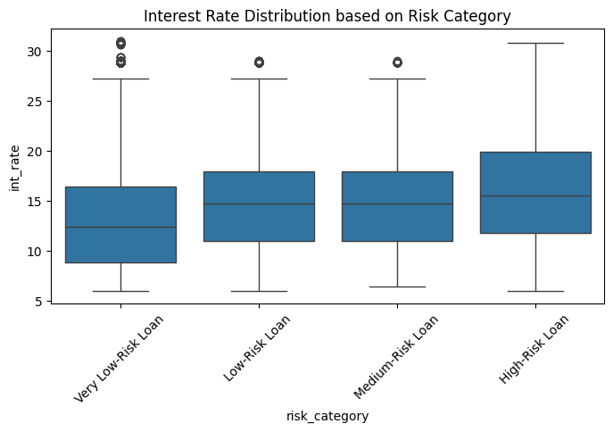
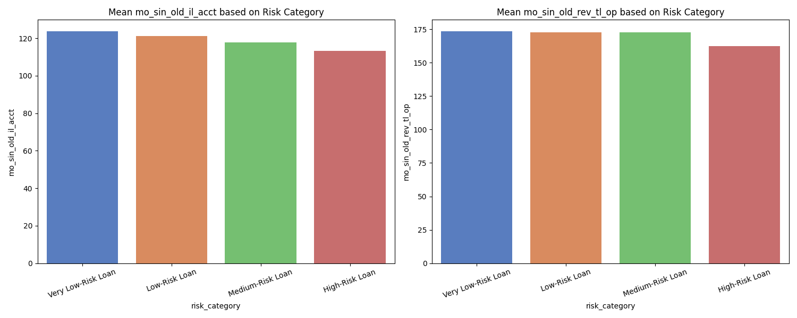
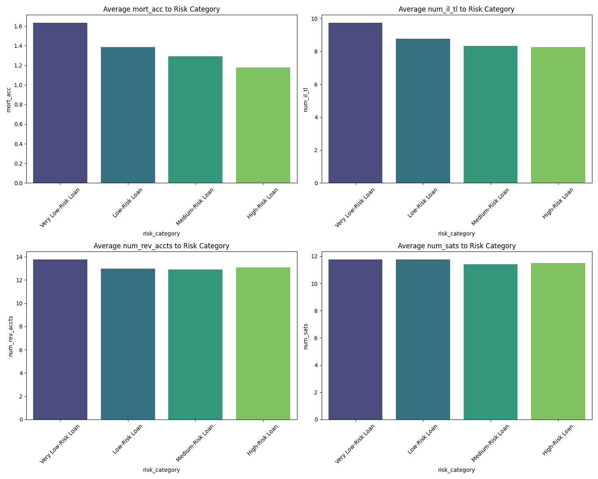
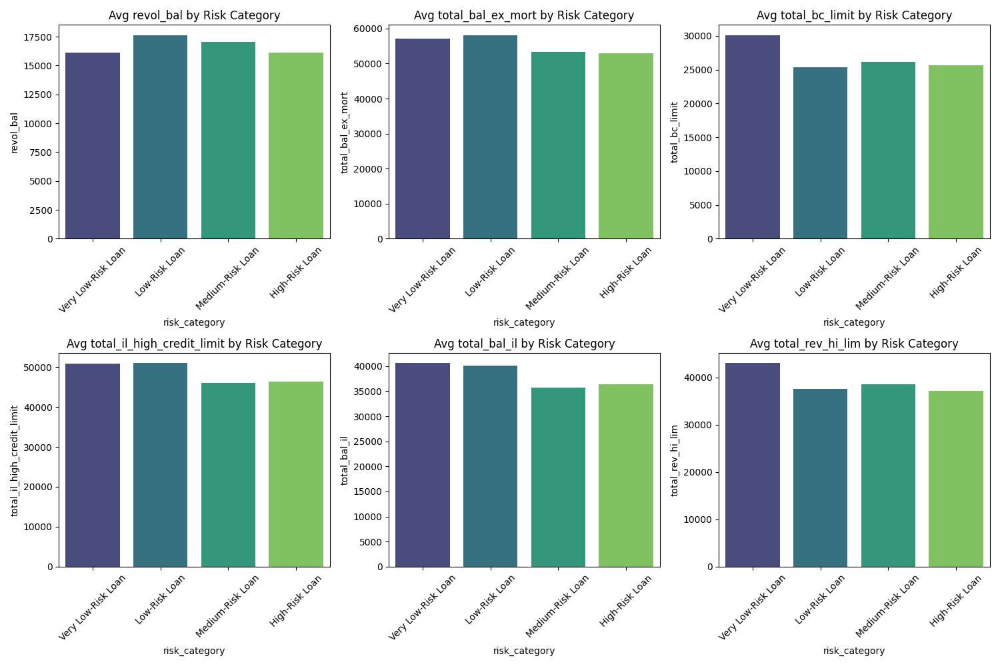
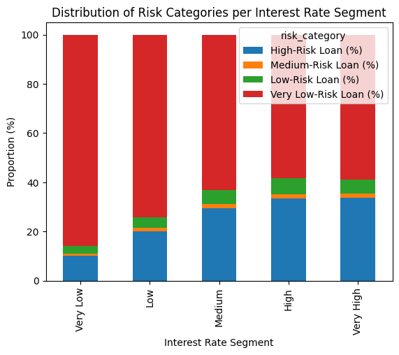
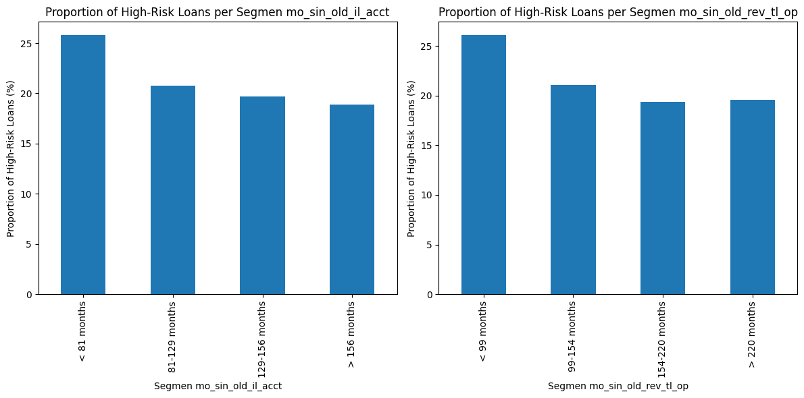
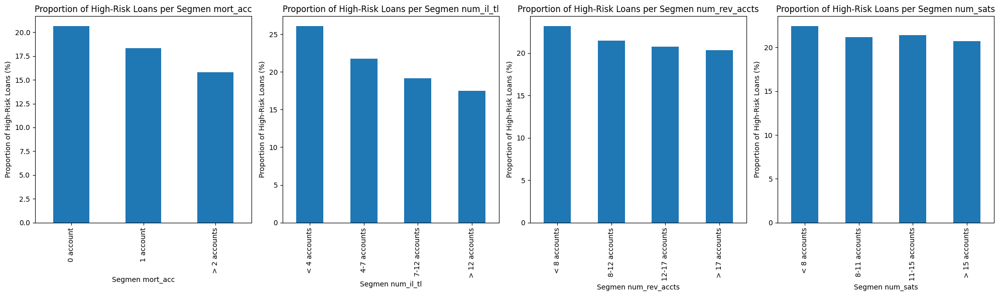
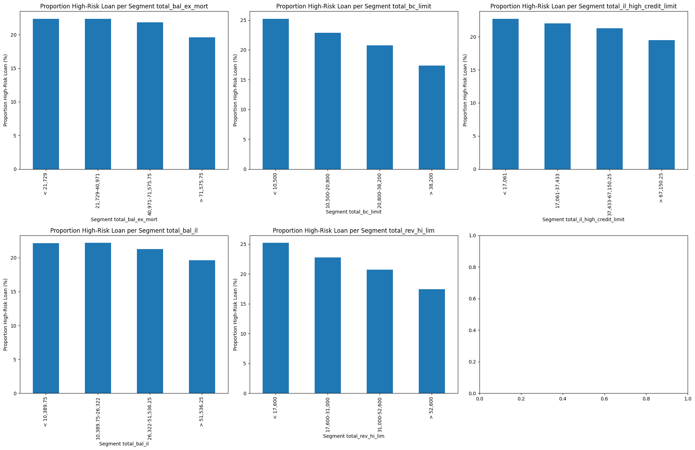

# Credit Risk Analysis and Optimization of Lending Decisions

## Project Description
How to understand the patterns and characteristics of high-risk loans and optimize the credit assessment process to reduce financial losses.

## Objectives
1. Proportion of Loan Status based on Risk Category
2. Delinquency & Default Risk
3. Credit Utilization & Debt Burden
4. Creditworthiness & Loan Terms
5. Credit History Age
6. Credit Account Metrics
7. Total Balance & Credit Limit

## Dataset
- **File Name**: `loan_2019_20.csv`
- **Source**: [Loan - Credit Risk & Population Stability](https://www.kaggle.com/datasets/beatafaron/loan-credit-risk-and-population-stability)
- **Dataset Size**: 664824 rows, 142 columns
- **Time Range Data Captured**: 2019 - 2020

## Tools and Technology
- Python: Pandas, Matplotlib, Seaborn, Numpy, Scipy and Sckit Posthocs
- Jupyter Notebook

## Methodology
1. **Data Collecting**
   - Understanding Data
   - Feature Selection
   - Filtering Feature
2. **Data Preprocessing**
   - Search for Missing Value
   - Handling for Missing Value
   - Search for Duplicate Value
   - Handling for Duplicate Value
3. **Explolatory Data Analysis (EDA)**
   - Delinquency & Default Risk
   - Credit Utilization & Debt Burden
   - Creditworthiness & Loan Terms
   - Credit History Age
   - Credit Account Metrics
   - Total Balance & Credit Limit
4. **Statistical Relationship Testing**
   - Interest Rate
   - Length of Credit History
   - The Relationship Between The Number of Active Credit Accounts and The Risk of Default
   - Total Balance and Credit Limit

## Results and Conclusions
**"Key Findings"**

1. **High Interest Rates Increase Risk**
   The higher the loan interest rate, the greater the risk of default. Borrowers with interest rates above 20% fall into the high-risk category.

2. **Short Credit History = High Risk**
   Borrowers with a short credit history (e.g., the first credit account opened within the last 3 years) have a higher risk compared to experienced borrowers.

3. **Low Number of Accounts Indicates Vulnerability**
   Borrowers with a low number of accounts (mortgage, installment loans, or revolving accounts) tend to be high-risk. Examples include:
   - No mortgage accounts.
   - Fewer than 4 installment loans.
   - Fewer than 8 revolving accounts.

4. **Financial Profile of High-Risk Borrowers**
   High-risk borrowers generally have:
   - Low average balances.
   - Small credit limits (e.g., total bank card limits below 10,500 currency units or total revolving limits below 17,600 currency units).

**"Strategic Recommendations"**

1. **Interest Rate Policy**
   Cap loan interest rates at a maximum of 20% to reduce exposure to high-risk loans.

2. **Prioritize Experienced Borrowers**
   Focus on borrowers with:
   - Long credit history (over 13 years for installment loans or 18 years for revolving credit).
   - Diversified credit portfolio:
      a. More than 2 mortgage accounts.
      b. More than 12 installment loans.
      c. More than 17 revolving accounts.

3. **Restrictions for High-Risk Borrowers**
   Reject or limit borrowers with:
   - No mortgage accounts.
   - Fewer than 4 installment loans or fewer than 8 revolving accounts.
   - Small total credit limits (bank cards <10,500 or revolving <17,600).
   For new borrowers, implement additional collateral requirements or loan ceiling restrictions.

4. **Credit Allocation to Safe Profiles**
   Prioritize borrowers with:
   - Total bank card limits above 38,200 currency units.
   - Total revolving credit limits above 52,600 currency units.

## Visualization Screenshots

## Repository Structure
| File/Folder                  | Description                                              |
|------------------------------|----------------------------------------------------------|
| `/loan_2019_20.csv`          | Dataset used in analysis                                 |
| `/LoanDataDictionary.xlsx`   | Information about the features in the dataset            |
| `/loan_2019_20_filtered.csv` | Dataset that has been filtered and relevant for analysis |
| `/Credit-Risk-Analysis.ipynb | Jupyter notebook files for analysis in python            |
| `/datasets/                  | The folder containing the dataset used                   |
| `/results/                   | Folder containing the results of the analysis            |
| `/data_cleaned.pkl           | Dataframes stored in pickle files                        |
| `/data_risk_category.pkl     | Dataframes stored in pickle files                        |
| `/README.md`                 | Repository documentation file                            |
