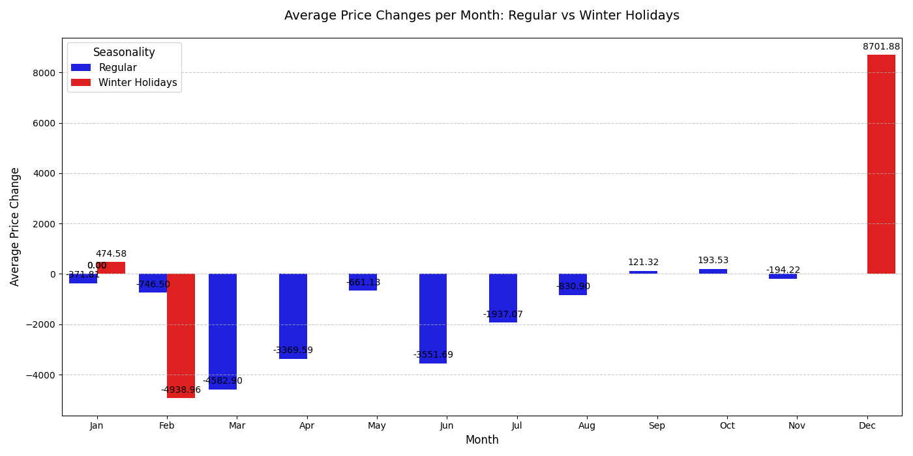
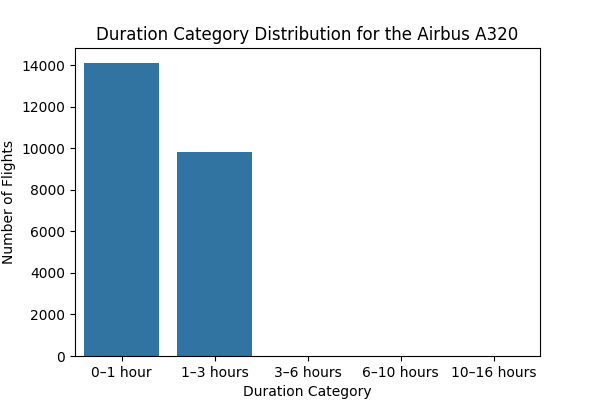

# Flight Price of Bangladesh Analysis

## Project Description
How to increase profitability by optimizing ticket pricing strategies.

## Objectives
1. Patterns that create changes in ticket prices
2. What variables or characteristics most significantly influence changes in ticket prices?
3. Characters or patterns that have high profits assuming operational costs are 60%

## Dataset
- **File Name**: `Flight_Price_Dataset_of_Bangladesh.csv`
- **Source**: [Flight Price Dataset of Bangladesh](https://www.kaggle.com/datasets/mahatiratusher/flight-price-dataset-of-bangladesh)
- **Dataset Size**: 57000 rows, 17 columns
- **Time Range Data Captured**: 2025 - 2026

## Tools and Technology
- Python: Pandas, Matplotlib, Seaborn, Numpy, Scipy, Sckit Posthocs, Kruskal, Multicomp
- Jupyter Notebook

## Methodology
1. **Preprocessing Data**
   - Features Selection
   - Missing Data
   - Duplicates
   - Data Type
2. **Explolatory Data Analysis (EDA)**
   - Feature Engineering
   - Seasonality
   - Days Before Deparature
   - Class
   - Aircraft Type
   - Route Booking Source
4. **Statistical Validation**
   - Shapiro-Wilk test: Feature X and Y are not normally distributed (p-value < 0.05).
   - Levene's test: Feature Z has heterogeneous variances across groups (p-value < 0.05).
   - Spearman's test: Feature A is significantly correlated with the target (ρ = 0.7, p-value < 0.01).
   - Kruskal-Wallis test: Feature B has a significant median difference across groups (p-value < 0.05).
   - Dunn's test (post-hoc): Group 1 vs. Group 3 differ significantly (adjusted p-value < 0.05).
5. **Insights**

## Results and Conclusions (Insights)
1. **Seasonality Drives Significant Price Changes**
    - *Winter Holidays* show the highest ticket prices, presenting an opportunity for increased margins.
    - *Regular Season* remains stable with no extreme fluctuations—ideal for implementing measured dynamic pricing strategies.

2. **Days Before Departure Have Minimal Impact**
    - While there is a statistical correlation between booking lead time and Total Fare, the effect is too small to influence pricing strategies. Focus should shift to more impactful factors.

3. **Flight Class Determines Pricing Tiers**
    - *First Class* can be *2x more expensive* than Business Class and *5x more* than Economy—highlighting potential for market segmentation and aggressive upselling.

4. **Aircraft Type Affects Pricing—Airbus A320 is Cheaper for Short-Haul Routes**
    - Airbus A320 (used for 1-3 hour flights) offers more competitive pricing, suggesting fleet and route optimization opportunities for higher profitability.

5. **Most Profitable Route: Saidepur Airport (DAC) to Suvarnabhumi (BKK), Bangkok**
    - This route yields the highest profit margin with an assumed 60% operational cost—prioritize promotions or increased flight frequency here.

6. **Booking Source Does Not Influence Base Fare**
    - The platform used for booking has no significant effect on Base Fare—pricing strategies should instead focus on seasonality, class, or route.

## Visualization Screenshots

## Repository Structure
| File/Folder                                | Description                                   |
|--------------------------------------------|-----------------------------------------------|
| `/Flight_Price_Dataset_of_Bangladesh.csv`  | Dataset used in analysis                      |
| `/flight-price-dataset-of-bangladesh.ipynb | Jupyter notebook files for analysis in python |
| `/data_cleaned.pkl                         | Dataframes stored in pickle files             |
| `/data_eda.pkl                             | Dataframes stored in pickle files             |
| `/data_eda(2).pkl                          | Dataframes stored in pickle files             |
| `/datasets/                                | The folder containing the dataset used        |
| `/README.md`                               | Repository documentation file                 |