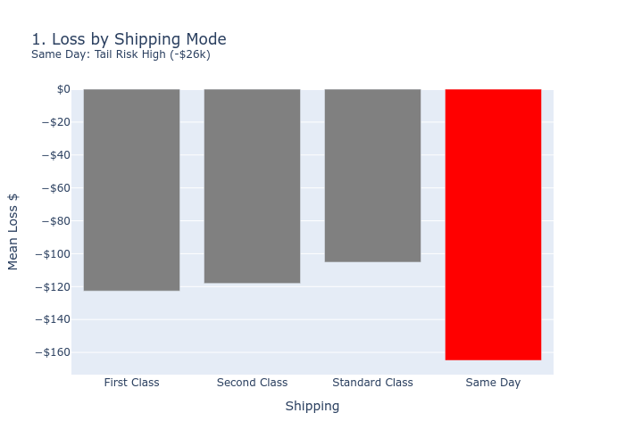
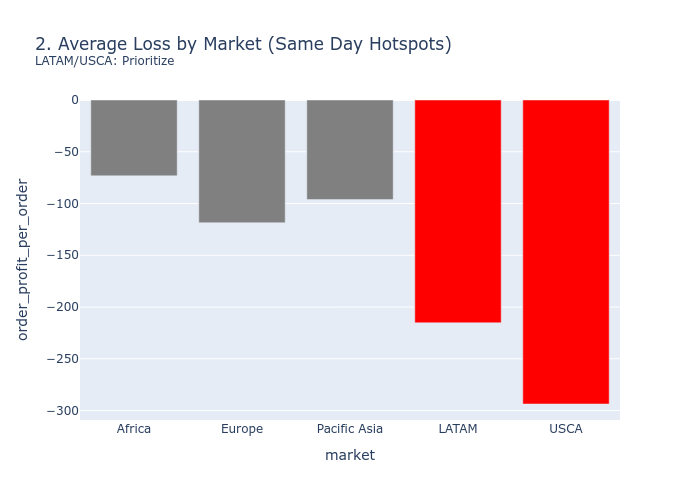
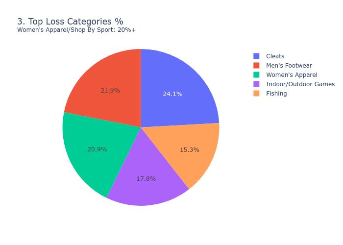
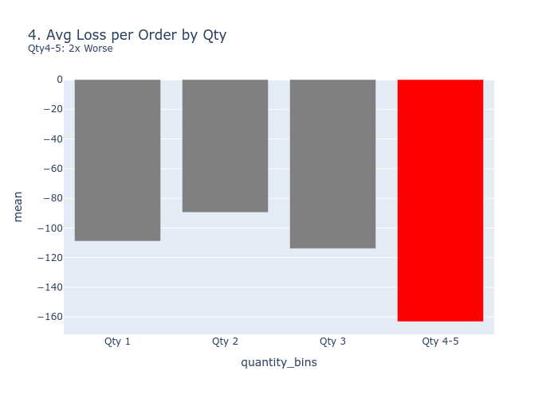
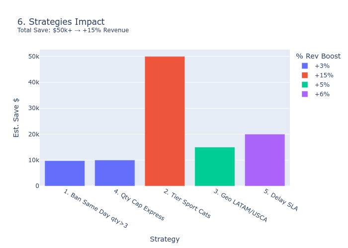
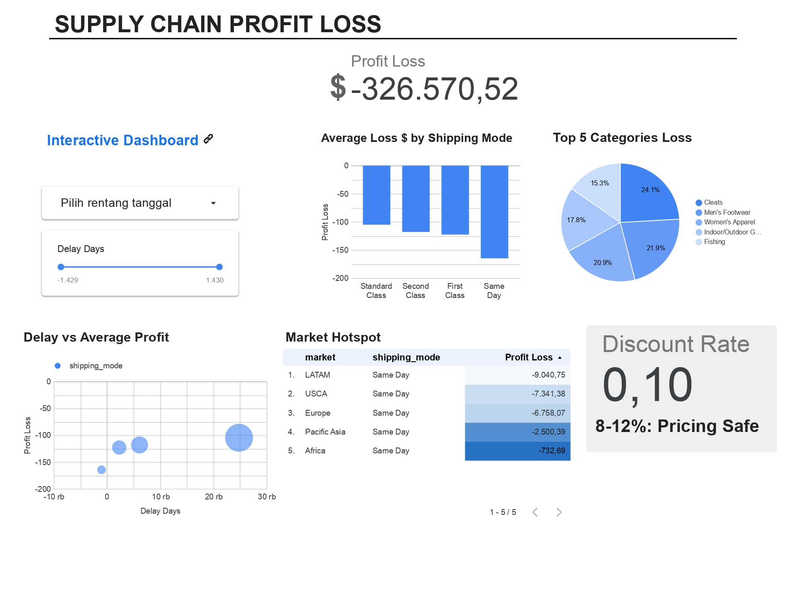

# Supply Chain Analysis

## Project Description
Analyze data in depth and provide concrete strategies to increase revenue in the coming quarter.

## Objectives
1. Increase next quarter's revenue through 3-5 actionable strategies
2. Identify problem: Why is there a loss?
3. Analyze negatif profit
4. Fix negatif Profit

## Dataset
- **File Name**: `incom2024_delay_example_dataset.csv`
- **Source**: [Logistics Supply chain real world data](https://www.kaggle.com/datasets/pushpitkamboj/logistics-data-containing-real-world-data/data)
- **Dataset Size**: 15549 rows, 41 columns

## Key Findings and Strategies
### Key Findings
- **Root Cause:** Same Day shipping di qty 4-5 (bundle sport/apparel) + geo LATAM/USCA (-$9.7k tail loss).
- **Not Discount:** Avg 8-12%, 0% >25%.
- **Anomaly:** Negative delays → data clean needed.
### 5 Strategies (Q Revenue +15%)
1. Ban Same Day qty>3: Save $9.7k (3%).
2. Geo Tier: Standard default LATAM/Africa.
3. Category Opt: Women's Apparel max qty3 express.
4. Delay Monitor: Vendor SLA <7 days.
5. Upsell: Bundle low-qty high-margin USCA.

**Impact:** Total loss -$326k → recoverable $50k+.

## Methodology
1. **Data Cleaning**
   - Features Selection
   - Missing Data
   - Duplicates
   - Data Type
2. **Explolatory Data Analysis (EDA)**
3. **Root Cause Analysis**
   - Status Order.
   - Pricing Discount Optimization.
   - Amplify Loss.
   - Profit Loss.
4. **Visualizing and Reporting**

## Visualization Screenshots and Dashboard

**Interactive Dashboard**: [Supply Chain Profit Loss Dashboard](Supply_Chain_Profit_Loss_Dashboard.pdf)