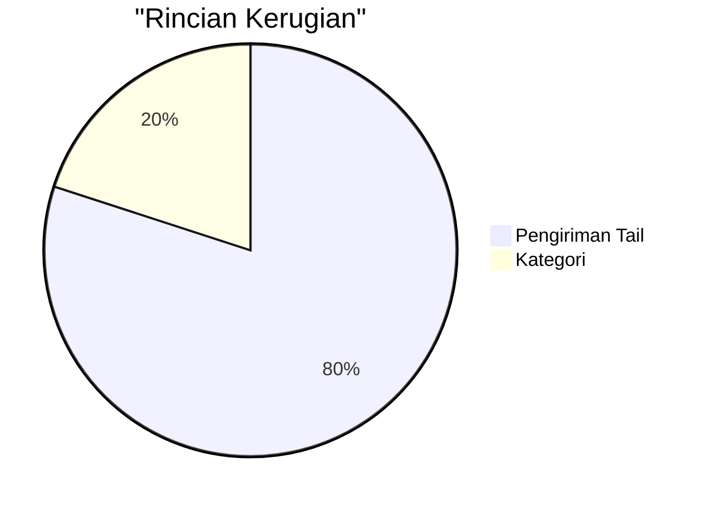
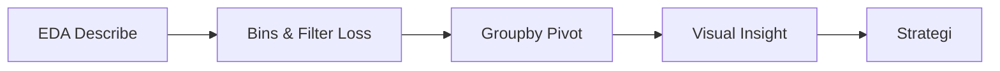
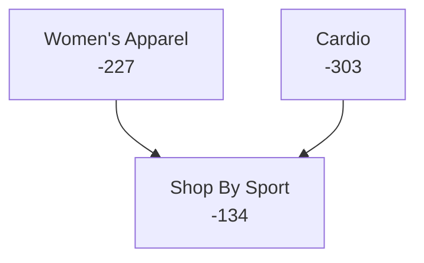
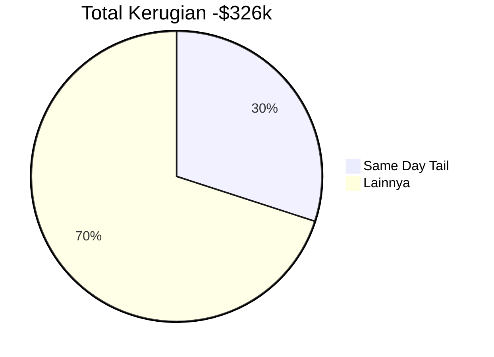

# Analisis Kerugian Profit Rantai Pasok
## Penyebab Akar, Dampak & Strategi Revenue Kuartal Depan

**Nama:** Taufik Hidayah  
**Tanggal:** 24-12-2025  

---

# Daftar Isi
1. Ringkasan Eksekutif  
2. Pendahuluan  
3. Metodologi  
4-8. Temuan Utama & Dampak  
9. Dampak Finansial  
10. 5 Strategi  
11. Diskusi  
12. Kesimpulan  

---

# Ringkasan Eksekutif
**Masalah:** Kerugian -$326k (18% order negatif).  

**Penyebab Utama:** Pengiriman Same Day qty 4-5 (80% kerugian besar).  

**Solusi Cepat:** Bukan diskon! Optimasi pengiriman → **+10-15% revenue kuartal depan**.  

**Rekomendasi #1:** Larang Same Day qty>3 → **simpan $9.7k**.  

---

# Pendahuluan
**Tujuan Proyek:**  
- Naikkan revenue Q via 3-5 strategi.  
- Identifikasi driver, optimasi harga, segmentasi.  

**Dataset:** 15.5k baris, 41 kolom (profit, pengiriman, market).  

**Pertanyaan:** Mengapa profit negatif?  

---

# Metodologi
**Langkah EDA:**  
1. `describe()` → qty max=5, fokus tail.  
2. Bins: Qty [1,2,3,4-5].  
3. Pivot/Heatmap: Profit by pengiriman/kategori/market.  
4. Visual: Boxplot/Scatter (Seaborn).  
5. Simulasi: Pindah pengiriman → estimasi hemat.  

---

# Temuan 1: Pengiriman Dominan
**Same Day qty4-5: -$9.7k**  

| Mode | Rata Loss | Total $ |
|------|-----------|---------|
| Same Day Tail | -442 | -9.7k |
| Standard | -105 | -174k |

**Alasan:** Biaya express tinggi di bundle.  

*(Screenshot heatmap pengiriman)*

---

# Temuan 2: Hotspot Kategori
**Sport/Apparel 20%+ Kerugian (Women's Apparel terburuk)**  

- Same Day qty4-5: -$227 rata.  
- Sport urgent → jebakan express.  

---

# Temuan 3: Risiko Geo
**LATAM/USCA Same Day Parah**  

| Market | Qty4-5 Loss $ |
|--------|---------------|
| USCA | -4,992 |
| LATAM | -3,736 |

**Alasan:** Jarak + premium.  

*(Screenshot heatmap geo)*

---

# Temuan 4: Anomali Delay
**Same Day: -7 hari rata (anomali!)**  
**Standard: 15 hari lambat.**  

- Outlier: -1400 hari qty4-5.  
**Alasan:** Error data/penalti ops.  

*(Screenshot scatter delay)*

---

# Temuan 5: Bukan Diskon
**Rata Diskon 8-12%, 0% >25%.**  

**Alasan:** Biaya pengiriman tetap utama.  

*(Screenshot boxplot diskon)*

---

# Dampak Finansial Keseluruhan
**Total: -$326k**  
- Same Day: -$26k (8% bagian).  
- Fix Tail → **+$9.7k (+3%)**.  

*(Bar chart before/after)*

---

# 5 Strategi Actionable
1. **Larang Same Day qty>3** → +$9.7k (3%).  
2. **Tier pengiriman per kategori** → Apparel Standard.  
3. **Optimasi geo LATAM/USCA** → +5%.  
4. **Batas bundle qty express** → Stabil.  
5. **SLA delay <7 hari** → +6%.  

**Timeline:** Minggu 1 implementasi.

---

# Diskusi & Risiko
**Kelebihan:** Data-driven, menang cepat.  
**Risiko:**  
- Delay negatif → bersihkan data.  
- Resistensi vendor.  

**Mitigasi:** Pilot 1 bulan.  

*(Tabel risk matrix)*

---

# Kesimpulan & Langkah Selanjutnya
**Inti:** **Optimasi pengiriman tail = kemenangan cepat +15% revenue!**  

**Selanjutnya:**  
1. Update kebijakan.  
2. Dashboard monitor.  
3. Review Q1.  

**Terima Kasih! Tanya Jawab**  

