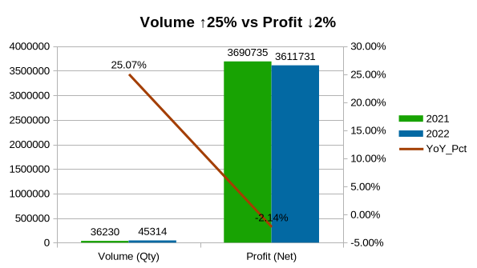
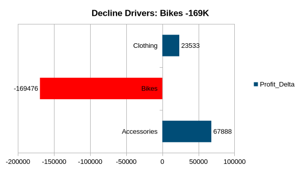
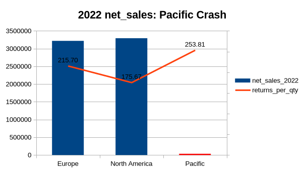
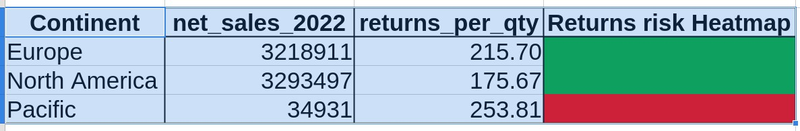
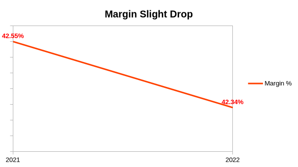

# AdventureWorks Sales Performance Analysis

## Deskripsi Proyek
Sebagai Analis Data untuk AdventureWorks Corp., saya menangani tantangan bisnis yang kritis: **mengidentifikasi penyebab akar penurunan keuntungan yang signifikan pada tahun 2022 meskipun volume penjualan meningkat**, dan memberikan rekomendasi aksi untuk pemulihan.

### Pernyataan Masalah
Profitabilitas menurun tajam dari tahun 2021 ke tahun 2022. Menganalisis faktor-faktor multidimensi termasuk tren penjualan, segmen pelanggan, kinerja produk, pengembalian, dan variasi wilayah untuk menemukan pendorong seperti erosi margin, kategori dengan pengembalian tinggi, dan wilayah dengan kinerja buruk.

## Objectives
1. Mengidentifikasi apakah penurunan profit benar-benar terjadi meskipun volume penjualan naik
2. Menemukan driver utama penurunan profit (kategori, wilayah, produk spesifik)
3. Melakukan root cause analysis pada produk penyebab terbesar
4. Mensimulasikan dampak perbaikan melalui What-If Analysis
5. Memberikan rekomendasi aksi berbasis data

## Dataset
- **File Name**: AdventureWorks `Calendar Lookup.csv`, `Customer Lookup.csv`, `Product Categories Lookup.csv`, `Product Lookup.csv`, `Product Subcategories Lookup.csv`, `Returns Data.csv`, `Sales Data 2020.csv`, `Sales Data 2021.csv`, `Sales Data 2022.csv`, `Territory Lookup.csv`
- **Source**: [Adventureworks Dataset](https://www.kaggle.com/datasets/shaikhshoeb/adventureworks-dataset-for-data-analysis)

## EDA 

> **Analisis EDA:** Profit Decline 2022 – Volume Naik 25% Tapi Profit Turun 2,14%  
> **Tools:** DuckDB (SQL) + Micrososft Excel / LibreOffice Calc

---

## 📌 Daftar Isi

<details>
<summary><b>1.1. Pendahuluan & Problem Statement</b></summary>

### 1.1.1 Latar Belakang
Sebagai Data Analyst AdventureWorks Corp., ditemukan anomali: **penjualan meningkat drastis** namun **profit justru menurun**.

### 1.1.2. Problem Statement
| Metrik | 2021 | 2022 | Perubahan |
|--------|------|------|-----------|
| **Volume (Qty)** | 36.230 | 45.314 | **+25,07% ↗️** |
| **Profit Bersih** | Rp 3.690.735 | Rp 3.611.732 | **-2,14% ↘️** |
| **Margin %** | 42,55% | 42,34% | -0,21 pp |
| **Returns (unit)** | 770 | 972 | +26,2% |

**Pertanyaan:**  
*"Mengapa profit turun meski penjualan naik? Driver utamanya apa?"*

### 1.1.3. Pendekatan Analisis
- **SQL (DuckDB):** Ekstrak data agregat per tahun, kategori, dan wilayah
- **Microsoft Excel / LibreOffice Calc:** DataPilot (PivotTable), filter interaktif, dashboard visual

</details>

<details>
<summary><b>1.2. SQL EDA Queries (DuckDB)</b></summary>

### 1.2.1. Data Sources
```sql
-- Dataset terdiri dari 3 file CSV:
-- 1) overall_metrics.csv      → Ringkasan tahunan
-- 2) top_drivers_dec.csv      → Breakdown per kategori produk
-- 3) dec_by_territory.csv     → Breakdown per benua
```

### 1.2.2. SQL untuk Overall Metrics
- **Fungsi:** Aggregate qty, revenue, cost, profit, returns per tahun
- **Advanced SQL:** CTE (`WITH`) chaining, `LAG()` untuk YoY, `COALESCE()` untuk null returns
- **Fokus:** Membuktikan volume naik + profit turun

### 1.2.3. SQL untuk Top Drivers (per Kategori)
- **Fungsi:** Breakdown per kategori (Bikes, Clothing, Accessories)
- **Advanced SQL:** `ROW_NUMBER()` untuk ranking penurunan profit
- **Temuan:** Bikes profit delta **-Rp169K** (rank 1)

### 1.2.4. SQL untuk Wilayah (Territory)
- **Fungsi:** `LEFT JOIN returns` untuk menghitung net sales setelah return
- **Temuan:** Pacific net sales 2022 = **Rp34K** (sebelumnya Rp4,27jt)

### 1.2.5. Export to CSV
```sql
COPY (SELECT ...) TO 'datasets/outputs/prof_dec/overall_metrics.csv' (FORMAT CSV, HEADER);
COPY (SELECT ...) TO 'datasets/outputs/prof_dec/top_drivers_dec.csv' (FORMAT CSV, HEADER);
COPY (SELECT ...) TO 'datasets/outputs/prof_dec/dec_by_territory.csv' (FORMAT CSV, HEADER);
```

</details>

<details>
<summary><b>1.3. EDA di Excel / Calc</b></summary>

### 1.3.1. Import & Clean Data
- File → Open → pilih CSV (separator koma)
- **Handle NaN:** Find & Replace (Ctrl+H) → ganti `null` → `0`)
- Gabung 3 CSV jadi 1 sheet: `01_decline_profit.csv` (26 kolom, 14 baris)

### 1.3.2. Membuat DataPilot (PivotTable)
- Data → Pivot Table → Layout:
  - **Row:** `year`
  - **Page (filter):** `categoryname`, `continent`, `source`, `decline_rank`
  - **Data:** `total_qty` (Sum), `net_profit` (Sum), `profit_yoy_pct` (Avg), `returns_per_qty` (Avg)

### 1.3.3. 6 Filter Combo untuk Eksplorasi
| # | Filter | Insight Kunci |
|---|--------|---------------|
| 1 | `source=Categories` + `decline_rank≤3` | Bikes rank 1: -Rp169K |
| 2 | `source=Territory` + `continent=Pacific` | Pacific net_sales anjlok 99% |
| 3 | `year=2022` + `profit_yoy_pct<0` | Profit -2,14% → Hypothesis confirmed |
| 4 | `categoryname=Bikes` + `source=Categories` | Margin erosi spesifik Bikes |
| 5 | `returns_per_qty>200` + `Territory` | Pacific returns tertinggi |
| 6 | Kombinasi Categories+2022+rank≤2 | Bikes turun vs Clothing naik |

### 1.3.4. Dashboard Index (Hyperlinked TOC)
1. Sheet `Dashboard_Index` berisi tabel dengan hyperlink ke 6 filter sheet
2. Kolom: `No | Sheet Name | Insight | Impact | Action | Status`
3. Klik → lompat ke sheet terkait

</details>

<details>
<summary><b>1.4. Visualisasi Dashboard</b></summary>

5 grafik utama di sheet `Viz_Dashboard`:

### 1.4.1. Volume vs Profit YoY

- Volume bar hijau naik, profit line turun → **Anomali jelas**

### 1.4.2. Profit Delta per Kategori

- Bikes bar merah ke kiri (-Rp169K), Clothing/Apparel hijau ke kanan

### 1.4.3. Net Sales per Wilayah 2022

- Pacific bar merah pendek, EU/NA tinggi → **Wilayah krisis**

### 1.4.4. Returns Heatmap

- Pacific 253/unit → merah terang

### 1.4.5. Margin Trend

- Margin tipis turun (42,55% → 42,34%)

</details>

<details>
<summary><b>1.5. Temuan Utama & Rekomendasi (Sementara)</b></summary>

### 1.5.1. Insight Kunci
| Dimensi | Driver | Dampak |
|---|--------|--------|
| 🥇 | **Bikes** – margin erosion | -Rp169K (~60% decline) |
| 🥇 | **Pacific** – returns tinggi | net_sales Rp34K, returns 253/unit |
| 🟢 | Clothing positif | +Rp23K mitigator |
| 🟡 | Margin overall | Turun tipis → bukan driver utama |

### 1.5.2. Root Cause Summary
> **Volume bukan masalah.** Profit turun karena:
> 1. **Erosi margin Bikes** (harga cost naik/price tidak naik)
> 2. **Returns tinggi di Pacific** (produk cacat atau logistik)

### 1.5.3. Rekomendasi Aksi
| Prioritas | Aksi | Target |
|-----------|------|--------|
| 🔴 High | Audit harga & cost Bikes, naikkan 2-3% | Pulihkan -Rp | 
| 🔴 High | QC & kebijakan no-return di Pacific | Turunkan returns >250/unit |
| 🟡 Medium | Scale Clothing & Accessories | Kompensasi profit |
| 🟢 Low | Monitoring margin overall | Jaga >42% |

</details>

---


<details>
<summary><b>2. Root Cause Analysis: Breakdown Sub-Product Bikes</b></summary>

> **Tools:** DuckDB (SQL) + Microsoft Excel/LibreOffice Calc  
> **Tujuan:** Menemukan **produk Bikes spesifik** (model, warna) yang paling menyebabkan penurunan profit

### 2.1. SQL untuk Data Sub-Product Bikes

```sql
-- sql/bikes_subcategory_analysis.sql
-- Output: bikes_subcategory_analysis.csv

WITH bike_products AS (
    SELECT 
        p.ProductKey, p.ModelName, p.ProductColor,
        p.ProductStyle, p.ProductSubcategoryKey,
        sub.SubcategoryName
    FROM product p
    JOIN product_subcategory sub 
        ON p.ProductSubcategoryKey = sub.ProductSubcategoryKey
    WHERE sub.SubcategoryName LIKE '%Bike%'
),

yearly_sales AS (
    SELECT 
        EXTRACT(YEAR FROM s.OrderDate) AS year,
        s.ProductKey,
        SUM(s.OrderQuantity) AS qty,
        SUM(s.OrderQuantity * p.ProductPrice) AS revenue,
        SUM(s.OrderQuantity * p.ProductCost) AS cost,
        SUM(s.OrderQuantity * (p.ProductPrice - p.ProductCost)) AS profit
    FROM sales_2021 s
    JOIN product p ON s.ProductKey = p.ProductKey
    GROUP BY year, s.ProductKey
    
    UNION ALL
    
    SELECT 
        EXTRACT(YEAR FROM s.OrderDate), s.ProductKey,
        SUM(s.OrderQuantity),
        SUM(s.OrderQuantity * p.ProductPrice),
        SUM(s.OrderQuantity * p.ProductCost),
        SUM(s.OrderQuantity * (p.ProductPrice - p.ProductCost))
    FROM sales_2022 s
    JOIN product p ON s.ProductKey = p.ProductKey
    GROUP BY 1, 2
)

SELECT 
    bp.ModelName, bp.ProductColor, bp.ProductStyle,
    bp.SubcategoryName, ys.year, ys.qty,
    ys.revenue, ys.cost, ys.profit
FROM bike_products bp
JOIN yearly_sales ys ON bp.ProductKey = ys.ProductKey
ORDER BY bp.ModelName, bp.ProductColor, ys.year;
```

---

### 2.2. Analisis di LibreOffice Calc

#### 2.2.1. Import & Pivot
1. Import `bikes_subcategory_analysis.csv` → sheet `Raw_Bikes`
2. Data → Pivot Table → Layout:
   - **Row:** `ModelName` + `ProductColor`
   - **Column:** `year`
   - **Data:** `profit` (Sum)
3. Hitung kolom `Profit_Delta` = `profit_2022 - profit_2021`

#### 2.2.2. Hasil: Profit Delta per Model & Warna

| Model | Warna | Profit 2021 | Profit 2022 | Delta |
|-------|-------|-------------|-------------|-------|
| Road-250 | Black | 492,423 | 201,446 | **-290,977** |
| Road-250 | Red | 290,100 | 54,235 | **-235,865** |
| Mountain-200 | Black | 798,965 | 682,941 | **-116,024** |
| Mountain-200 | Silver | 771,433 | 683,705 | **-87,728** |
| Road-650 | Red | 48,612 | 0 | **-48,612** |
| Road-650 | Black | 46,610 | 0 | **-46,610** |
| Touring-1000 | Yellow | 193,056 | 352,734 | **+159,677** |
| Touring-1000 | Blue | 202,078 | 364,461 | **+162,384** |
| Road-350-W | Yellow | 192,347 | 371,088 | **+178,741** |
| ... | ... | ... | ... | ... |
| **TOTAL** | | **3,668,907** | **3,501,636** | **-167,271** |

---

### 2.3. Aggregasi per Model (Total Delta)

| Model | Total Delta | Kontribusi thd Penurunan |
|-------|-------------|--------------------------|
| **Road-250** | **-526,842** | **315%** ⚠️ |
| **Mountain-200** | **-203,752** | **122%** ⚠️ |
| Road-650 | -95,223 | 57% |
| Touring-1000 | +322,061 | **-192%** (menutupi) ✅ |
| Road-350-W | +178,741 | **-107%** (menutupi) ✅ |

> **Catatan:** Road-250 turun Rp526K sendiri → **lebih besar dari total penurunan Bikes (-Rp167K)** karena model lain (Touring-1000, Road-350-W) tumbuh positif dan menutupi sebagian kerugian.

---

### 2.4. Analisis Warna: Tidak Signifikan

| Model | Warna 1 Delta | Warna 2 Delta | Beda | Kesimpulan |
|-------|---------------|---------------|------|------------|
| Road-250 | Black: -290K | Red: -235K | ~55K (18%) | Keduanya turun drastis |
| Mountain-200 | Black: -116K | Silver: -87K | ~28K (11%) | Keduanya turun drastis |
| Touring-1000 | Yellow: +159K | Blue: +162K | ~2.7K (1.6%) | Keduanya naik |

> **Kesimpulan:** Warna bukan faktor penyebab. Yang bermasalah adalah **modelnya** (Road-250, Mountain-200), bukan warnanya.

---

### 2.5. Temuan & Rekomendasi Root Cause

| Temuan | Bukti | Rekomendasi |
|--------|-------|-------------|
| **Road-250 adalah penyebab #1** | Delta -Rp526K (315% dari total penurunan) | Audit harga jual & biaya produksi segera |
| **Mountain-200 penyebab #2** | Delta -Rp203K (122%) | Evaluasi spesifikasi & harga |
| **Warna tidak signifikan** | Perbedaan delta antar warna <20% | Tidak perlu tindakan berbasis warna |
| **Touring-1000 & Road-350-W sehat** | Tumbuh +Rp500K kombinasi | Scale up produksi & marketing |

</details>

---

<details>
<summary><b>3. What-If Simulation: Profit Recovery 2023</b></summary>

> **Tools:** LibreOffice Calc (Formula + Goal Seek)  
> **Tujuan:** Mensimulasikan dampak perbaikan terhadap profit 2023

### 3.1. Asumsi Simulasi

| Variable | Skenario 1 | Skenario 2 | Skenario 3 |
|----------|------------|------------|------------|
| **Bikes Margin Improvement** | +1% | +5% | +10% |
| **Pacific Returns Reduction** | -10% | -20% | -30% |
| **Non-Bikes Volume Growth** | 10% | 10% | 10% |

**Baseline 2022:**
| Item | Value |
|------|-------|
| Total Profit 2022 | Rp 3,611,731 |
| Bikes Profit 2022 | Rp 3,477,544 |
| Non-Bikes Profit | Rp 134,187 |
| Pacific Returns Value | Rp 277,297 |

---

### 3.2. Model Perhitungan

```
Total Profit 2023 = 
    Bikes_New_Profit              (= Bikes_Current × (1 + Margin_Improvement))
  + Non_Bikes_New_Profit          (= Non_Bikes × (1 + Volume_Growth))
  + Pacific_Returns_Savings       (= Returns_Current × Returns_Reduction)

```
</details>

---

<details>
<summary><b>4. Struktur File (Output)</b></summary>

```
adventureworks-eda/
├── analysis/
│   ├── 01_eda.md
│   └── 02_deep_dive.md
├── datasets/
│   ├── metadata.md
│   └── outputs/prof_dec/
│       ├── overall_metrics.csv
│       ├── top_drivers_dec.csv
│       └── dec_by_territory.csv
├── excel/01_eda/
│   ├── 01_decline_profit.xlsx
│   └── sheets:
│       ├── Dashboard_Index
│       ├── Viz_Dashboard
│       ├── Data_For_Viz
│       ├── 01_Top3_Decliners
│       ├── 02_Pacific_Crisis
│       ├── 03_YoY_Negative
│       ├── 04_Bikes_Drivers
│       ├── 05_High_Returns
│       ├── 06_Top2_2022_Fix
├── excel/02_deep_dive/
│   ├── 02_bikes_model_and_colour.xlsx
│   └── sheets:
│       ├── Summary_RootCause
│       ├── Raw_Bikes
│       ├── Pivot_Bikes
│       ├── Bikes_Sorted
│   ├── 02_deep_dive.xlsx
│   └── sheets:
│       ├── bikes_subcategory
│       ├── Model vs Profit
│       ├── WhatIf
│   ├── 02_root_cause_analysis.xlsx
│   └── sheets:
│       ├── bikes_subcategory
│       ├── Pivot Table_bikes_subcategory_1
│       ├── Pivot Table_bikes_subcategory_2
├── excel/03_WhatIf_Simulation/
│   ├── 03_WhatIf.xlsx
│   └── sheets:
│       ├── Summary_WhatIf
│       ├── WhatIf_Baseline
│       ├── WhatIf_Input
│       ├── WhatIf_Calculation
│       ├── WhatIf_Viz
├── images/
│   ├── 01_margin_trend.png
│   ├── 01_net_sales.png
│   ├── 01_profit_delta_per_kategori.png
│   ├── 01_returns_heatmap.png
│   ├── 01_volume_vs_profit_yoy.png
│   ├── 02_Model_Name_vs_Profit_Delta.png
│   ├── 02_Profit_Delta_Bikes.png
│   ├── 02_Profit_Delta_per_Products_Bikes_(2021-2022).png
│   └── 03_Profit_Recovery_2023_Skenario.png
├── outputs/deep_dive/
│   ├── bikes_model_and_colour.csv
│   ├── bikes_subcategory_v2.csv
│   └── bikes_subcategory_v2.csv
├── outputs/prof_dec/
│   ├── dec_by_territory.csv
│   ├── overall_metrics.csv
│   └── top_drivers_dec.csv
├── sql/
│   └── query_SQL.ipynb
├── README.md