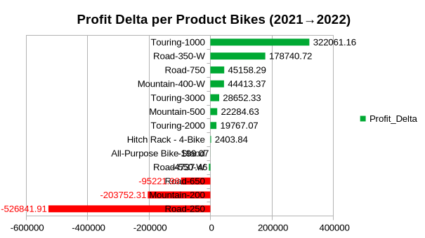
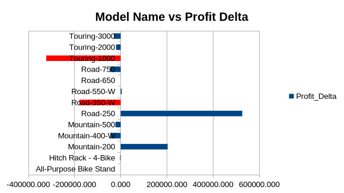
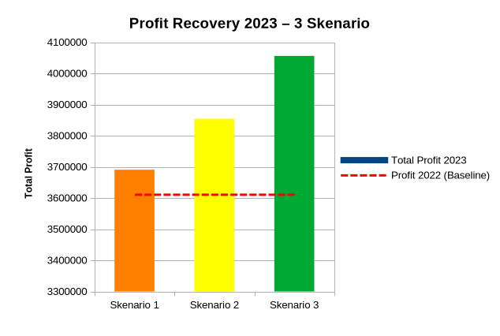

<!-- _paginate: false -->

# Analisis Performa Penjualan
## AdventureWorks Corp. - Tahun 2022

<br>

**Analisis Penurunan Profit & Strategi Pemulihan**

<br>

| | |
|---|---|
| **Analis Data** | Taufik Hidayah |
| **Departemen** | Business Intelligence |
| **Tanggal** | 1 Mei 2026 |

---

# Daftar Isi

| No | Topik | Halaman |
|----|-------|---------|
| 1 | Executive Summary | 3 |
| 2 | Introduction & Problem Statement | 4-5 |
| 3 | Methodology | 6 |
| 4 | Findings: Anomali Profit | 7 |
| 5 | Findings: Driver per Kategori | 8 |
| 6 | Findings: Krisis Pacific | 9 |
| 7 | Findings: Root Cause Bikes | 10-11 |
| 8 | Findings: What-If Simulation | 12 |
| 9 | Discussion | 13 |
| 10 | Conclusion & Rekomendasi | 14 |

---

# Executive Summary

### Temuan Kritis

<div class="danger">

- **Volume naik 25%** (36K → 45K unit)
- **Profit turun 2,14%** (Rp3,69M → Rp3,61M)
- **Returns naik 26%** (770 → 972 unit)

</div>

### 3 Driver Utama Penurunan

| Rank | Driver | Dampak |
|------|--------|--------|
| 🥇 | Erosi margin kategori Bikes | -Rp169K |
| 🥈 | Returns tinggi wilayah Pacific | 253/unit |
| 🥉 | Model Road-250 bermasalah | -Rp526K |

> **Insight:** Volume bukan masalah. Profit turun karena efisiensi operasional.

---

# Introduction

## Latar Belakang

AdventureWorks Corp. menghadapi **anomali bisnis** di tahun 2022:

- Penjualan **meningkat drastis** (+25%)
- Profit **menurun signifikan** (-2,14%)

## Pertanyaan Kunci

> *"Mengapa profit turun meski penjualan naik?*
> *Apa driver utamanya?"*

---

# Problem Statement

## Metrik Kunci 2021 vs 2022

| Metrik | 2021 | 2022 | Perubahan |
|--------|------|------|-----------|
| **Volume (Qty)** | 36.230 | 45.314 | **+25,07%** ↗️ |
| **Profit Bersih** | Rp3,69M | Rp3,61M | **-2,14%** ↘️ |
| **Margin %** | 42,55% | 42,34% | -0,21 pp |
| **Returns (unit)** | 770 | 972 | **+26,2%** ↗️ |

<div class="highlight">

**Anomali Teridentifikasi:**
Volume naik 25%, tetapi profit justru turun 2,14%

</div>

---

# Methodology

<div class="columns">

### Tools & Techniques

| Layer | Tool | Fungsi |
|-------|------|--------|
| **Data** | DuckDB (SQL) | Agregasi, CTE, Window |
| **Analysis** | Excel/Calc | PivotTable, Filter |
| **Viz** | Dashboard | Grafik, Heatmap |

### Process Flow

```
┌─────────────┐
│  Raw Data   │
│  (9 CSV)    │
└──────┬──────┘
       ↓
┌─────────────┐
│ SQL Queries │
│ (DuckDB)    │
└──────┬──────┘
       ↓
┌─────────────┐
│ CSV Export  │
│ (3 files)   │
└──────┬──────┘
       ↓
┌─────────────┐
│ Excel Pivot │
│ & Dashboard │
└─────────────┘
```

</div>

---

# Finding 1: Anomali Volume vs Profit


| Indikator | Tren | Interpretasi |
|-----------|------|--------------|
| **Volume (Bar)** | Naik konsisten | Demand meningkat |
| **Profit (Line)** | Menurun | Margin tergerus |

> **Conclusion:** Volume bukan masalah. Ada faktor lain yang menyebabkan profit turun.

---

# Finding 2: Driver Penurunan per Kategori


| Kategori | Delta Profit | Status |
|----------|-------------|--------|
| **Bikes** | **-Rp169K** | ⚠️ **Kritis** |
| Clothing | +Rp23K | ✅ Positif |
| Accessories | -Rp16K | ⚠️ Negatif |

<div class="danger">

**Bikes** bertanggung jawab atas **60% penurunan profit total**

</div>

---

# Finding 3: Krisis di Wilayah Pacific

<div class="columns">

### Net Sales per Wilayah


### Returns Heatmap


</div>

| Wilayah | Net Sales 2022 | Returns/unit |
|---------|----------------|--------------|
| **Pacific** | **Rp34K** | **253** |
| Europe | Rp1,45M | 120 |
| North America | Rp2,13M | 145 |

> Pacific mengalami penurunan **99%** dengan returns **2x lebih tinggi**

---

# Finding 4: Root Cause - Model Bikes



### Top 3 Model Bermasalah

| Model | Delta Profit | Kontribusi |
|-------|-------------|------------|
| **Road-250** | **-Rp526K** | 315% ⚠️ |
| **Mountain-200** | **-Rp203K** | 122% ⚠️ |
| Road-650 | -Rp95K | 57% |

<div class="danger">

**Road-250** turun **-Rp526K** sendiri, **lebih besar dari total penurunan Bikes (-Rp167K)**

</div>

---

# Finding 5: Analisis Warna vs Model



### Perbandingan per Model & Warna

| Model | Warna 1 | Warna 2 | Beda |
|-------|---------|---------|------|
| Road-250 | Black: -290K | Red: -235K | 18% |
| Mountain-200 | Black: -116K | Silver: -87K | 11% |
| Touring-1000 | Yellow: +159K | Blue: +162K | 2% |

<div class="success">

**Kesimpulan:** Warna **bukan faktor**. Yang bermasalah adalah **modelnya**.

</div>

---

# Finding 6: What-If Simulation 2023



### Asumsi Strategi

| Strategi | Skenario 1 | Skenario 2 | Skenario 3 |
|----------|------------|------------|------------|
| Bikes Margin | +1% | +5% | +10% |
| Pacific Returns | -10% | -20% | -30% |
| Non-Bikes Growth | +10% | +10% | +10% |

> **Target:** Pulihkan profit ke **Rp3,8M** dengan kombinasi perbaikan

---

# Discussion: Mengapa Ini Terjadi?

### 3 Hipotesis Utama

| # | Hipotesis | Bukti |
|---|-----------|-------|
| 1 | **Pricing Strategy Gagal** | Cost naik, harga stagnan |
| 2 | **Quality Control Buruk** | Returns Pacific 2x lipat |
| 3 | **Product Lifecycle** | Road-250 di akhir siklus |

### Bukti Pendukung

<div class="highlight">

- Touring-1000 & Road-350-W **tumbuh positif**
- Produk baru lebih sehat daripada produk lama
- Pacific = wilayah dengan logistik terlemah

</div>

---

# Conclusion & Rekomendasi

### 🔴 High Priority (Q1 2023)

| Aksi | Target | Dampak |
|------|--------|--------|
| Audit harga Bikes (+2-3%) | Pulihkan margin | +Rp169K |
| QC & kebijakan returns Pacific | Turunkan returns | -253 ke 200/unit |

### 🟡 Medium Priority (Q2-Q3)

| Aksi | Target | Dampak |
|------|--------|--------|
| Scale produk positif | Touring-1000, Road-350-W | +Rp500K |

### 🟢 Low Priority (Q4)

| Aksi | Target | Dampak |
|------|--------|--------|
| Monitoring margin | Dashboard otomatis | Jaga >42% |

---

<!-- _paginate: false -->

# Terima Kasih

## Key Takeaways

1. **Volume ≠ Profit** - Fokus pada efisiensi
2. **Root cause spesifik** - Road-250 & Pacific
3. **Data-driven decisions** - Analisis untuk pricing & quality